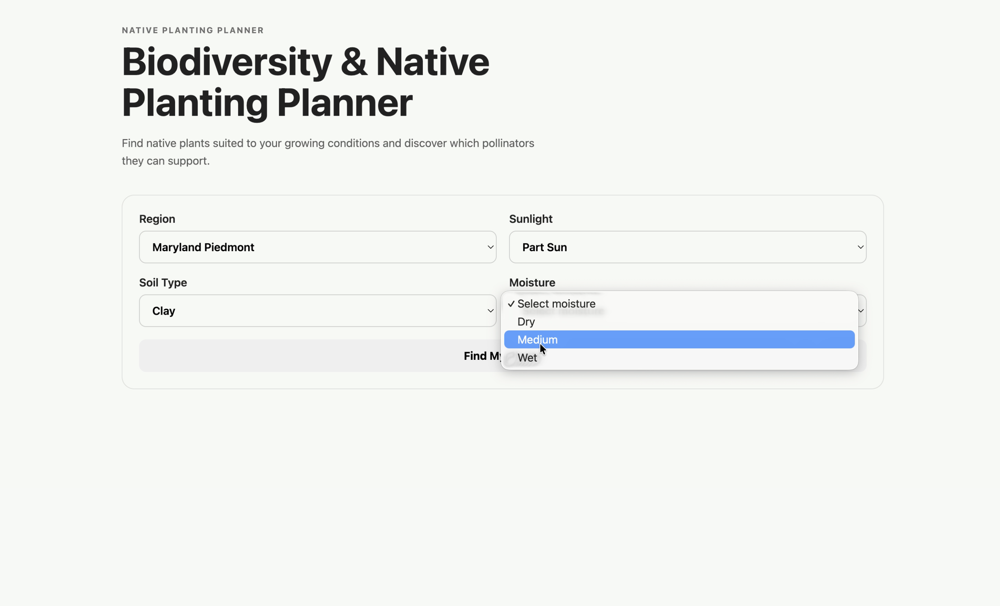
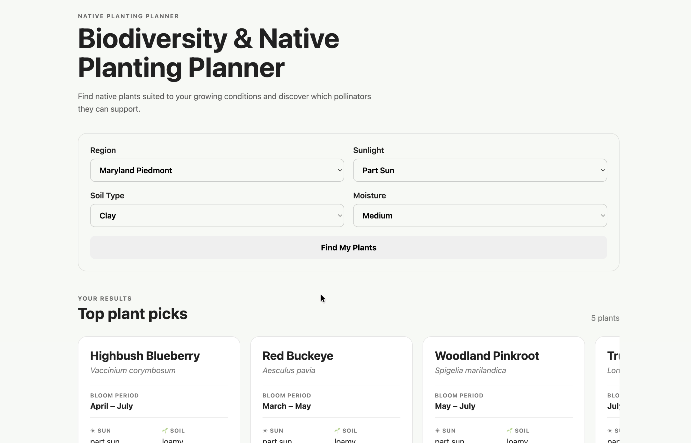
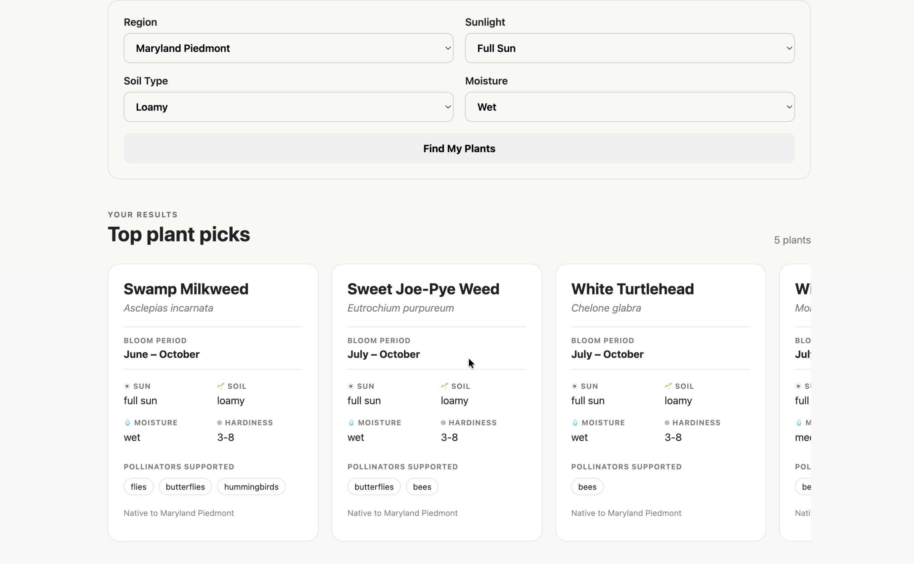

# Biodiversity & Native Planting Planner

A web application that helps urban gardeners discover native plants suited to their growing conditions while highlighting their potential contribution to local pollinator biodiversity.

> **Catalyst Architects — Grow with Google Capstone**
>
> Aligned with **United Nations Sustainable Development Goal 15: Life on Land**

---

## 🌱 Project Overview

Urban gardeners can contribute to local biodiversity through the plants they choose, but identifying ecologically appropriate plants often requires information from multiple botanical, gardening, and biodiversity resources.

The **Biodiversity & Native Planting Planner** brings this information together into a simple recommendation experience.

Instead of asking users to research individual plant species, the application allows them to provide a few characteristics of their growing environment and returns a ranked set of native plant recommendations.

The current MVP focuses on the **Maryland Piedmont** region and uses a curated dataset of native plant species and their:

- Growing conditions
- Bloom periods
- Pollinator associations
- USDA hardiness zones
- Native range
- Data sources

The goal is not simply to recommend plants that can survive in an environment, but to help users make planting decisions that can contribute to local biodiversity.

---

## 🎯 Problem Statement

> **Urban gardeners lack simple, automated visual tools to identify and choose native plant species that support local pollinator populations.**

Choosing plants with biodiversity in mind can require answering several questions:

- Is this plant native to my region?
- How much sunlight does it require?
- What type of soil does it prefer?
- How much moisture does it need?
- When does it bloom?
- Which pollinators does it support?
- Is it appropriate for the local climate?

This information is often distributed across different ecological and gardening resources.

The project aims to simplify that process by translating structured plant and biodiversity data into understandable recommendations.

---

## 💡 Our Approach

The application uses a curated regional plant dataset and a rule-based recommendation engine.

The user selects:

1. **Region**
2. **Sunlight**
3. **Soil type**
4. **Moisture**

The backend then:

1. Loads the curated plant dataset.
2. Filters plants according to the selected geographic region.
3. Evaluates compatibility with the user's sunlight conditions.
4. Evaluates soil compatibility.
5. Evaluates moisture compatibility.
6. Considers pollinator-group support.
7. Considers bloom duration.
8. Calculates a recommendation score.
9. Returns the highest-ranked plants.

The recommendations are presented as visual plant cards containing practical growing information and biodiversity-related information.

---

## Current Geographic Scope

The MVP is intentionally scoped to the **Maryland Piedmont** region.

The dataset uses `native_range` to represent the geographic region where a plant naturally occurs without human introduction. This distinction is important to the project's purpose: the application is intended to identify ecologically appropriate native plants rather than simply plants that can survive in a particular location.

Currently, the region selector contains one supported option:

```text
Maryland Piedmont
```

The architecture is designed so that additional regions can be supported in the future when sufficiently complete and reliable regional plant datasets become available.

---

## User Experience

The current user flow is:

```text
Select region
      ↓
Select sunlight conditions
      ↓
Select soil type
      ↓
Select moisture level
      ↓
Generate recommendations
      ↓
View ranked native plant recommendations
```

The application intentionally avoids exposing the underlying ecological dataset directly to users.

Instead, users receive concise plant cards containing practical and biodiversity-related information such as:

- Common name
- Scientific name
- Bloom period
- Sunlight requirements
- Soil requirements
- Moisture requirements
- Hardiness zones
- Supported pollinators
- Native region

---

## Recommendation Engine

The recommendation engine uses an explainable rule-based scoring system rather than a machine-learning model.

The current scoring heuristic is:

| Criterion | Maximum Score |
|---|---:|
| Sunlight compatibility | 30 |
| Soil compatibility | 25 |
| Moisture compatibility | 20 |
| Pollinator-group diversity | 15 |
| Bloom duration | 10 |
| **Total** | **100** |

Growing-condition compatibility receives the largest portion of the score because these values directly represent the user's selected conditions.

Pollinator support and bloom duration contribute additional biodiversity-oriented ranking factors.

The scoring weights are an **application-level heuristic for the MVP**, not a scientific measure of ecological value. They are kept deliberately simple and transparent so that the recommendation logic can be refined as the dataset and project scope expand.

---

## Architecture

The application consists of a React frontend and a Python FastAPI backend.

```text
                         User
                           │
                           ▼
                    React Frontend
                           │
                           │ POST /recommend
                           ▼
                    FastAPI Backend
                           │
                           ▼
                     Plant Service
                           │
                           ▼
                  Curated Plant Dataset
                           │
                           ▼
                 Recommendation Engine
                           │
                           ▼
                 Ranked Recommendations
                           │
                           ▼
                    React Frontend
                           │
                           ▼
                    Plant Cards
```

### Backend

The backend is responsible for:

- Request validation
- Loading the plant dataset
- Filtering plants by geographic region
- Evaluating growing-condition compatibility
- Ranking recommendations
- Returning structured API responses

### Frontend

The frontend is responsible for:

- Collecting user preferences
- Communicating with the FastAPI backend
- Displaying loading and error states
- Presenting ranked recommendations
- Displaying plant and biodiversity information in an accessible format

---

## 📁 Project Structure

The project is organized by team member contribution while keeping the application itself under the shared `biodiversity-planner` project directory.

**Final repository tree:**

```text
└── biodiversity-planner
    ├── Alexis-Paitoo
    │   └── datasets
    │       ├── data_dictionary.md
    │       ├── plant_species_template.csv
    │       └── plants.csv
    ├── docs
    │   └── biodiversity-planner-webapp.mov
    ├── Ishika-Brar
    │   └── src
    │       ├── backend
    │       │   ├── app
    │       │   │   ├── main.py
    │       │   │   ├── models
    │       │   │   │   ├── request_models.py
    │       │   │   │   └── response_models.py
    │       │   │   ├── recommendation_engine.py
    │       │   │   ├── routes
    │       │   │   └── services
    │       │   │       ├── location_service.py
    │       │   │       ├── plant_service.py
    │       │   │       └── weather_service.py
    │       │   └── requirements.txt
    │       └── frontend
    │           ├── eslint.config.js
    │           ├── index.html
    │           ├── package-lock.json
    │           ├── package.json
    │           ├── src
    │           │   ├── App.css
    │           │   ├── App.jsx
    │           │   ├── assets
    │           │   │   ├── hero.png
    │           │   │   ├── react.svg
    │           │   │   └── vite.svg
    │           │   ├── index.css
    │           │   └── main.jsx
    │           └── vite.config.js
    └── README.md

```

---

## Technology Stack

### Frontend

- React
- Vite
- JavaScript
- HTML
- CSS

### Backend

- Python
- FastAPI
- Pydantic
- Pandas
- Uvicorn

### Data

- CSV
- Curated native plant and pollinator information
- Regional native-range data

### Development

- Git
- GitHub

---

## 📊 Dataset

The current plant dataset contains **40 plant species** scoped to the Maryland Piedmont region.

The dataset contains fields including:

- `species_id`
- `common_name`
- `scientific_name`
- `native_range`
- `bloom_start`
- `bloom_end`
- `sun_needs`
- `soil_type`
- `moisture`
- `pollinators_supported`
- `hardiness_zones`
- `source`
- `source_url`
- `notes`

The dataset standardizes growing-condition values so that they can be consistently filtered and compared by the recommendation engine.

The dataset was prepared as a separate contribution under the **Alexis-Paitoo** project folder and is consumed by the backend plant service.

---

## 🔌 Backend API

### `GET /`

Returns a basic API status message.

### `POST /recommend`

Accepts the user's selected growing conditions.

Example request:

```json
{
  "region": "Maryland Piedmont",
  "sunlight": "full sun",
  "soil_type": "well-drained",
  "moisture": "dry"
}
```

The endpoint returns the selected conditions together with a ranked list of plant recommendations.

---

## 🚀 Running the Project Locally

### Backend

Navigate to the backend:

```bash
cd biodiversity-planner/Ishika-Brar/src/backend
```

Create and activate a virtual environment:

```bash
python3 -m venv .venv
source .venv/bin/activate
```

Install dependencies:

```bash
pip install -r requirements.txt
```

Start the FastAPI development server:

```bash
uvicorn app.main:app --reload
```

The backend will be available at:

```text
http://127.0.0.1:8000
```

FastAPI's interactive API documentation is available at:

```text
http://127.0.0.1:8000/docs
```

### Frontend

Open another terminal and navigate to:

```bash
cd biodiversity-planner/Ishika-Brar/src/frontend
```

Install dependencies:

```bash
npm install
```

Start the Vite development server:

```bash
npm run dev
```

Open the local URL provided by Vite in your browser.

---

## Future Development

The current MVP establishes the core recommendation workflow. Several extensions are possible as additional data becomes available.

### Expand geographic coverage

The current application supports only the Maryland Piedmont.

Future versions could support additional regions by adding sufficiently complete regional datasets and expanding the region selector.

### Location-aware recommendations

The backend contains a location service that can convert user-entered locations into geographic coordinates.

The current MVP intentionally uses a controlled regional selector rather than arbitrary location input because the available plant dataset is currently scoped to one defined region.

A future version could allow users to enter a city or address and use geographic information to determine the appropriate regional dataset.

### Weather-aware recommendations

A weather service foundation is included in the backend architecture.

Future versions could use localized weather information for features such as:

- Weather-aware care guidance
- Watering recommendations
- Plant stress alerts
- Seasonal planting guidance

### Additional plant data

Future datasets could include additional information such as:

- Plant size and growth habit
- Container suitability
- Maintenance requirements
- Garden-space requirements
- More detailed climate compatibility
- Additional pollinator relationships
- Regional bloom calendars

### Improved recommendation models

The current system uses an explainable rule-based scoring approach.

As more reliable data becomes available, the recommendation system could be expanded with more sophisticated ranking or machine-learning approaches.

---

## 🌎 Sustainable Development Goal

This project aligns with:

**UN Sustainable Development Goal 15 — Life on Land**

The project focuses on making biodiversity-conscious planting decisions more accessible to everyday urban gardeners.

By encouraging the use of regionally appropriate native plants and highlighting their relationships with pollinators, the application aims to help users make planting choices that can contribute to healthier local ecosystems.

---

## 👥 Team — Catalyst Architects

| Track | Contributor |
|---|---|
| IT Automation | Ishika Brar |
| Data Analytics | Alexis Paitoo |
| Digital Marketing | Frances Nwose |
| Cybersecurity | Arnav Ghorpade |
| Project Management | Muzamil Nadeem |

### Contributions

**Ishika Brar — IT Automation**

- Project architecture
- FastAPI backend
- Recommendation engine
- Dataset integration
- React frontend
- API integration
- MVP implementation and testing

**Alexis Paitoo — Data Analytics**

- Maryland Piedmont native-plant dataset
- Dataset schema and data dictionary
- Plant and pollinator data preparation
- Data sourcing and verification

**Frances Nwose — Digital Marketing**

- Project documentation and README contribution
- Project communication and user-oriented framing

**Arnav Ghorghade — Cybersecurity**

- NA

**Muzamil Nadeem — Project Management**

- NA

---

## 📚 Grow with Google Connection

This project was developed as part of the **Grow with Google / Mentor Me Collective** program.

The project brings together skills across software development, data analytics, digital marketing, cybersecurity, and project management to address a real-world sustainability problem.

---

## 📸 Project Walkthrough

[▶️ Watch the Application Walkthrough](./docs/biodiversity-planner-webapp.mov)

### Application Preview







---

## 📌 Project Status

### Current MVP

- [x] React frontend
- [x] FastAPI backend
- [x] Pydantic request/response validation
- [x] Curated Maryland Piedmont plant dataset
- [x] Dataset loading and validation
- [x] Region selection
- [x] Sunlight selection
- [x] Soil selection
- [x] Moisture selection
- [x] Recommendation scoring
- [x] Pollinator-support ranking
- [x] Bloom-duration ranking
- [x] Ranked recommendation cards
- [x] Loading state
- [x] Error handling
- [x] Empty-results state
- [x] Frontend/backend integration

### Future Work

- [ ] Expand to additional geographic regions
- [ ] Enable arbitrary location input
- [ ] Integrate location-aware environmental data
- [ ] Expand plant dataset
- [ ] Add weather-aware guidance
- [ ] Improve recommendation methodology with additional validated data
- [ ] Deploy a production version

---

## 📄 License

MIT License

